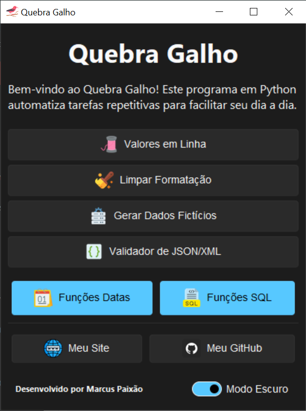

# Quebra Galho - 

<p align="center">
  
  
</p>

<p align="center">
  <strong>Uma caixa de ferramentas em Python para automatizar tarefas do dia a dia.</strong>
</p>

<p align="center">
    <a href="https://github.com/Vini-Paixao/Quebra-Galho/releases">
        
    </a>
    <a href="https://github.com/Vini-Paixao/Quebra-Galho/blob/main/LICENSE.md">
        
    </a>
</p>

## 💡 Sobre o Projeto

**Quebra Galho** é uma aplicação de desktop desenvolvida em Python para automatizar tarefas repetitivas e simplificar processos comuns do dia a dia. O que começou como uma ferramenta interna para otimizar o trabalho na JBS, evoluiu para um projeto de código aberto com uma interface moderna e intuitiva, pronto para ajudar qualquer pessoa a ser mais produtiva.

## ✨ Funcionalidades

O aplicativo conta com um conjunto de ferramentas poderosas, divididas em categorias:

- **Valores em Linha**: Converte uma lista de valores (copiada de uma coluna, por exemplo) em uma única linha, separados por vírgula, ideal para cláusulas `IN` em consultas SQL.
- **Limpar Formatação**: Remove todos os caracteres não numéricos de campos com máscara, como CPF, CNPJ, NF-e ou CEP.
- **Gerador de Dados Fictícios**: Cria dados de teste (nomes, e-mails, documentos, etc.) e os exporta para planilhas Excel (`.xlsx`), CSV ou XML.
- **Formatador de XML/JSON**: Valida e indenta corretamente arquivos XML (incluindo NF-e) e JSON, facilitando a leitura e a identificação de erros.
- **Funções de Datas**:
  - **Converter Data**: Converte datas de formatos comuns (DD/MM/YYYY, DDMMYYYY, etc.) para o padrão americano (`YYYY-MM-DD`).
  - **Calcular Dias Úteis**: Calcula o total de dias úteis e corridos entre duas datas, desconsiderando feriados nacionais e finais de semana.
- **Funções de SQL**:
  - **Validar Sintaxe**: Verifica a sintaxe de scripts SQL utilizando o `sqlfluff` para o dialeto T-SQL.
  - **Gerador de Scripts**: Gera templates básicos de `INSERT`, `UPDATE` e `DELETE` a partir de informações fornecidas pelo usuário.
  - **Formatação de Consulta**: Formata scripts SQL com indentação e palavras-chave em maiúsculas, melhorando a legibilidade.
  - **Exportação de Consulta**: Exporta o resultado de consultas (copiado da sua ferramenta de banco de dados) para os formatos **CSV, XML** ou **Excel (.xlsx)**.

## 🚀 Tecnologias Utilizadas

Este projeto foi construído com as seguintes tecnologias:

- **Python**: A linguagem principal por trás de toda a lógica.
- **Tkinter**: A biblioteca padrão do Python para a criação da interface gráfica.
- **Sun Valley TTK Theme**: Um tema moderno que renova completamente o visual dos componentes Tkinter, com suporte a modo claro e escuro.
- **Pandas**: Utilizado para a manipulação de dados, principalmente nas funções de geração e exportação.
- **Pillow**: Para manipulação e exibição de ícones na interface.
- **lxml**: Para um processamento de XML robusto e eficiente.
- **PyInstaller**: Para empacotar a aplicação em um executável único para Windows.

## 🛠️ Instalação e Execução

### Executável (Recomendado)

A maneira mais fácil de usar o Quebra Galho é baixar a versão mais recente pronta para uso.

1. Acesse a página de [**Releases**](https://github.com/Vini-Paixao/Quebra-Galho/releases).
2. Faça o download do arquivo `QuebraGalho.exe`.
3. Execute o arquivo.
    - *Observação: O Windows pode exibir um aviso de segurança por ser um programa de um desenvolvedor não reconhecido. Basta clicar em "Mais informações" e depois em "Executar mesmo assim".*
    
    

### Manualmente (Para Desenvolvedores)

Se você deseja executar o projeto a partir do código-fonte:

1. **Clone o repositório:**

    ```bash
    git clone https://github.com/Vini-Paixao/Quebra-Galho.git
    cd Quebra-Galho
    ```

2. **(Opcional) Crie um ambiente virtual:**

    ```bash
    python -m venv venv
    source venv/bin/activate  # No Windows: venv\Scripts\activate
    ```

3. **Instale as dependências:**

    ```bash
    pip install -r requirements.txt
    ```

4. **Execute o programa:**

    ```bash
    python main.py
    ```

## 🤝 Contribuição

Contribuições são sempre bem-vindas! Se você tem alguma ideia para melhorar o Quebra Galho, sinta-se à vontade para:

1. Fazer um "fork" do repositório.
2. Criar uma nova "branch" para sua funcionalidade (`git checkout -b feature/minha-feature`).
3. Fazer "commit" das suas alterações (`git commit -m 'feat: Adiciona minha-feature'`).
4. Enviar para a sua "branch" (`git push origin feature/minha-feature`).
5. Abrir um "Pull Request".

## 📄 Licença

Este projeto está sob a licença MIT. Veja o arquivo [LICENSE.md](LICENSE.md) para mais detalhes.
