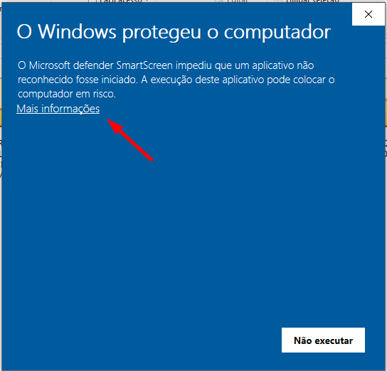
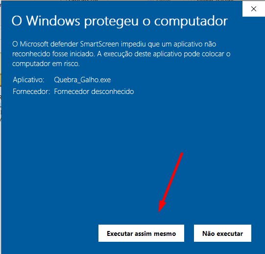

# Quebra Galho - 

Um programa em Python que auxilia em tarefas do dia a dia, facilitando assim tarefas "chatas" e que podem ser realizadas de maneira automática, desenvolvi esse programa com intuito de me auxiliar no meu trabalho na JBS, assim facilitando consultas SQL e tarefas do dia a dia.

## Funcionalidades

- **Valores em Linha** - Recebe uma certa quantidade de dados empilhados um em cima do outro, e transforma todos em linha separado por vírgula, facilitando consultas SQL.
- **Limpar Formatação** - Recebe qualquer tipo de numeração com máscara (CPF, NF-e, CEP) e retira todos os caracteres não numéricos, mantendo apenas os números e facilitando consultas SQL.
- **Funções Datas**
  - **Converter Data** - Recebe datas em diversos formatos e automaticamente coloca em formato americano para consultas SQL
  - **Calcular Dias Úteis** - Recebe uma data de ínicio e uma data final e calcula quantos dias úteis tem entre as 2 datas considerando feriados nacionais e finais de semana.
- **Funções SQL**
  - **Validar Sintaxe** - Recebe um Script SQL e faz a validação se o mesmo é um script que rodaria sem nenhum erro de sintaxe.
  - **Gerador de Scripts** - Gera Scripts SQL básicos (INSERT, UPDATE e DELETE) com base nos dados fornecidos.
  - **Formatação de Consulta** - Recebe um SCRIPT SQL e formata o mesmo na indentação correta, facilitando na hora de visualizar os dados e realizar a consulta.
  - **Exportação de Consulta** - Recebe o resultado de uma consulta SQL e fornece a opção de exportar em **CSV, XML** ou **Excel (.xlsx)** assim facilitando a manipulação de dados externamente.

## Instalação

### Executável

Caso não queira ter que compilar o arquivo no seu computador o projeto já está compilado.

1. Acesse a aba de [Release](https://github.com/Vini-Paixao/Quebra-Galho/releases) e realizar o download do .exe (Disponível somente para **Windows**).

2. Após baixar o arquivo dê 2 cliques no arquivo .exe e clique em "Mais Informações" e depois clique em "Sim", conforme Imagens abaixo. (Essa mensagem aparecer por se tratar de um programa não licenciado pela Microsoft na qual ela retorna que pode se tratar de vírus)



##

### Manual

Caso prefira pode Fazer manualmente na sua IDE de preferência, certifiquesse de ter o Python e o pip instalado na máquina, e siga os passos a passos:

1. Clonando o Projeto:

  ```bash
    git clone https://github.com/Vini-Paixao/Quebra-Galho.git
  ```

2. Entrando na pasta do projeto:

  ```bash
    cd Quebra-Galho
  ```

3. Instalando as depêndencias externas:

  ```bash
    pip install -r requirements.txt
  ```

4. Executando:

  ```bash
    python main.py
  ```

## Licença

[](https://opensource.org/licenses/MIT)
