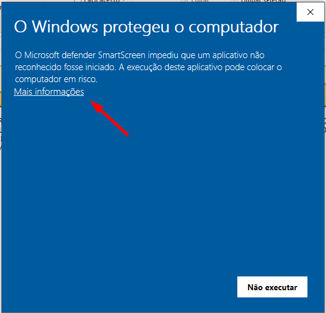
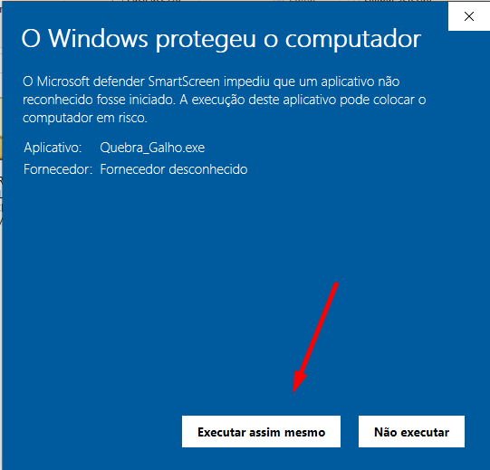

# Quebra Galho - 

Quebra Galho é um programa em Python desenvolvido para automatizar tarefas repetitivas e facilitar o dia a dia. Originalmente criado para auxiliar no meu trabalho na JBS, o aplicativo agora está disponível publicamente para ajudar outras pessoas com necessidades semelhantes.

## Funcionalidades

- **Valores em Linha**: Transforma dados empilhados em uma única linha, separados por vírgula, facilitando consultas SQL.
- **Limpar Formatação**: Remove caracteres não numéricos de qualquer tipo de numeração com máscara (CPF, NF-e, CEP), mantendo apenas os números.
- **Gerador de Dados Fictícios**: Gera dados fictícios para consultas ou inclusão de dados, com opções para Nome, Email, Telefone, Endereço, CPF/CNPJ, etc., e exporta os resultados em um arquivo EXCEL (.xlsx).
- **Formatador de XML/JSON**: Valida e formata XMLs e JSONs, com exibição instantânea e opção de exportação dos arquivos formatados.
- **Funções Datas**:
  - **Converter Data**: Converte datas em diversos formatos para o formato americano, facilitando consultas SQL.
  - **Calcular Dias Úteis**: Calcula o número de dias úteis entre duas datas, considerando feriados nacionais e finais de semana.
- **Funções SQL**:
  - **Validar Sintaxe**: Valida a sintaxe de scripts SQL.
  - **Gerador de Scripts**: Gera scripts SQL básicos (INSERT, UPDATE e DELETE) com base nos dados fornecidos.
  - **Formatação de Consulta**: Formata scripts SQL para uma indentação correta, facilitando a visualização e execução.
  - **Exportação de Consulta**: Exporta o resultado de consultas SQL em **CSV, XML** ou **Excel (.xlsx)**.

## Instalação

O programa está disponível para download, permitindo uso e teste rápidos. Você também pode seguir o passo a passo manual para executar o programa na sua IDE de preferência.

### Executável

1. Acesse a aba de [Releases](https://github.com/Vini-Paixao/Quebra-Galho/releases) e faça o download do arquivo .exe (disponível apenas para **Windows**).
2. Após baixar o arquivo, clique duas vezes no .exe, selecione "Mais Informações" e depois clique em "Sim" para executar (essa mensagem aparece porque o programa não é licenciado pela Microsoft).




### Manual

1. Clone o repositório:

    ```bash
    git clone https://github.com/Vini-Paixao/Quebra-Galho.git
    ```

2. Entre na pasta do projeto:

    ```bash
    cd Quebra-Galho
    ```

3. Instale as dependências externas:

    ```bash
    pip install -r requirements.txt
    ```

4. Execute o programa:

    ```bash
    python main.py
    ```

## Contribuição

Contribuições são bem-vindas! Siga os passos abaixo para contribuir:

1. Faça um fork do repositório.
2. Crie uma branch para sua feature ou correção de bug (`git checkout -b feature/nova-feature`).
3. Faça commit das suas alterações (`git commit -m 'Adiciona nova feature'`).
4. Envie para a branch (`git push origin feature/nova-feature`).
5. Abra um Pull Request.

## Licença

Este projeto está licenciado sob a licença MIT. Veja o arquivo LICENSE para mais detalhes.

[](https://opensource.org/licenses/MIT)
